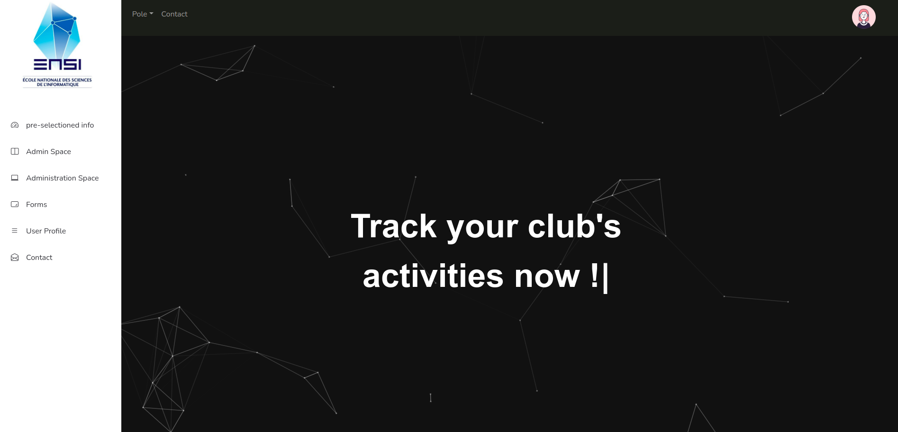
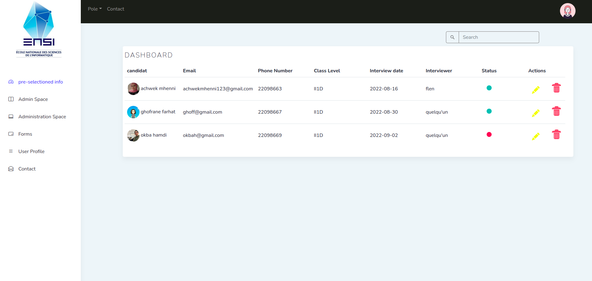
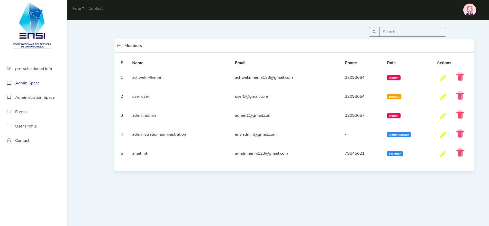
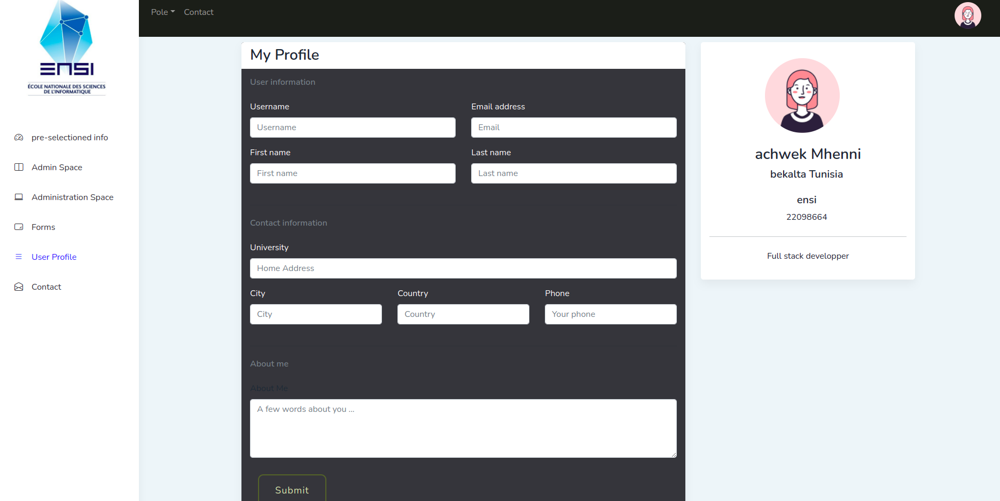
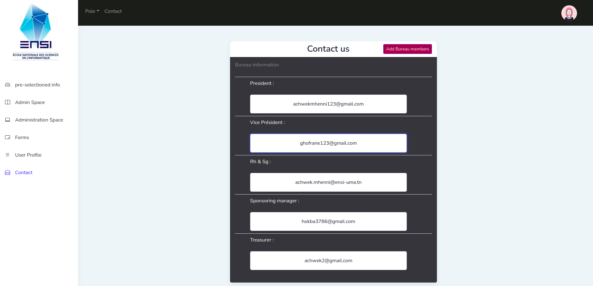
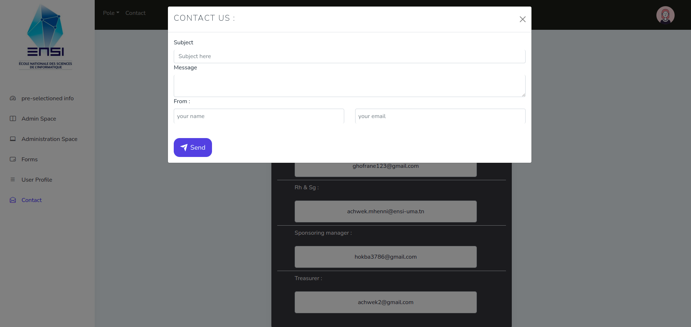

<!-- Heading of Template -->
<h1>
  Ensi Clubs Platform
</h1>

<!-- Main image of Template -->

<!-- Description of Template -->

 Ensi clubs platform is a web application designed for the ensi's club to manage their activities and orchestrate the communication between the clubs members, executive board, administration ...

  These are the main interfaces of our application

<!-- Versions of Template -->

<!-- Upgrade to Premium version of Template -->
<h2>Landing page</h2>
    
     
    
<h2>Pre-selectionned members list</h2>
    
         

<h2>Admin space</h2>
    
         

<h2>User profile</h2>
    
         

<h2>Contact</h2>
    
         

  
         

    
    
    
